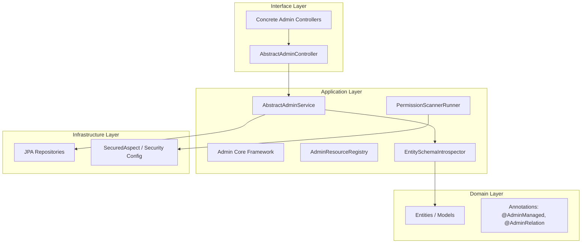

# Tổng quan Kiến trúc Admin (priz-base)

Tài liệu này cung cấp cái nhìn chi tiết về kiến trúc Admin được triển khai trong dự án `priz-base`. Hệ thống được thiết kế theo hướng **Metadata-Driven** và tuân thủ chặt chẽ **Onion Architecture**, giúp tối ưu hóa khả năng mở rộng và bảo trì.

---

## 1. Vị trí trong Onion Architecture

Kiến trúc Admin không nằm tập trung tại một chỗ mà được phân bổ qua các lớp của Onion Architecture để đảm bảo tính đóng gói và linh hoạt:



- **Domain Layer**: Chứa các Entity (JPA Models) được đánh dấu bằng các Metadata Annotation. Đây là "Single Source of Truth" cho cấu trúc dữ liệu.
- **Application Layer**: Chứa bộ khung logic (Core Framework). `AbstractAdminService` điều phối việc chuyển đổi giữa DTO (Map) và Entity. `AdminResourceRegistry` quản lý danh sách các resource khả dụng.
- **Interface Layer**: Cung cấp các REST Adapter. Các Controller cụ thể (như `UserAdminController`) chỉ đóng vai trò định nghĩa Endpoint URL và inject service tương ứng.
- **Infrastructure Layer**: Xử lý việc truy vấn DB thực tế và áp dụng các khía cạnh (Aspect) về bảo mật.

---

## 2. Các Design Pattern Cốt Lõi

Hệ thống áp dụng các mẫu thiết kế để đạt được sự cân bằng giữa tính tổng quát và tính đặc thù:

### Template Method Pattern (`AbstractAdminService`)
Cung cấp một luồng thực thi (Workflow) chuẩn cho mọi tác vụ CRUD:
1. `validateRequest()`
2. `beforeCreate()` / `beforeUpdate()` (Hook)
3. `convertToEntity()` (Reflection)
4. `saveToDatabase()` (JPA)
5. `afterCreate()` / `afterUpdate()` (Hook)
6. `convertToMap()` (Reflection)

### Registry Pattern (`AdminResourceRegistry`)
Mỗi Admin Service khi khởi tạo sẽ tự đăng ký vào Registry. Điều này cho phép hệ thống quản lý tập trung và hỗ trợ các API mang tính hệ thống (như `AdminMetaController` để lấy danh sách tất cả menu admin).

### Introspection Pattern (`EntitySchemaIntrospector`)
Sử dụng Java Reflection để "soi" cấu trúc Entity tại runtime. Nó tự động phát hiện:
- Các trường bắt buộc (`@Column(nullable = false)`).
- Các trường quan hệ (`@OneToMany`, `@ManyToOne`).
- Các chỉ dẫn hiển thị (`@AdminHidden`, `@AdminManaged`).

---

## 3. Cơ Chế Bảo Mật & Phân Quyền (Bitmask Integration)

Hệ thống Admin tích hợp sâu với cơ chế **Bitmask Authorization** để đảm bảo an toàn dữ liệu ở mức độ tinh vi:

### Phân quyền cơ bản (Role-based)
Mặc định, các API trong `AbstractAdminController` được bảo vệ bởi:
`@Secured(roles = {"ADMIN"})`

### Phân quyền chi tiết (Bitmask-based)
Có thể ghi đè (Override) các method trong Controller cụ thể để áp dụng Bitmask:
```java
@Override
@Secured(permissions = {PermissionAction.DELETE}, customKey = "user_manager")
public ResponseEntity<ApiResponse<Void>> delete(@PathVariable String id) {
    return super.delete(id);
}
```

### Auto-Discovery (`PermissionScannerRunner`)
Khi ứng dụng khởi chạy, `PermissionScannerRunner` sẽ quét toàn bộ các Controller. Nếu phát hiện các method có `@Secured` với `customKey`, nó sẽ tự động đăng ký các Resource Key này vào hệ thống phân quyền, giúp Admin có thể cấu hình Matrix phân quyền ngay lập tức mà không cần code thêm.

---

## 4. Quản lý Mối quan hệ (Relationship Management)

Sử dụng `@AdminRelation` để định nghĩa cách xử lý các bảng liên kết:
- **Fetch Type**: Hỗ trợ Eager/Lazy loading tùy theo Metadata.
- **UI Hint**: Cung cấp thông tin cho Frontend để hiển thị SelectBox hoặc Search Modal cho các trường Foreign Key.
- **Recursive Loading**: Hỗ trợ tham số `include` trong các API Filter/Detail để lấy dữ liệu lồng nhau (Nested data) mà không gây ra lỗi N+1 nhờ `EntityGraph` hoặc Dynamic Specification.

---

## 5. Luồng Dữ Liệu (Data Flow)

1. **Request**: Frontend gửi `Map<String, Object>` (JSON) chứa các trường dữ liệu.
2. **Controller**: Tiếp nhận request, kiểm tra Role/Permission.
3. **Service**: 
   - Tìm Entity tương ứng qua `AdminResourceRegistry`.
   - Gọi `EntitySchemaIntrospector` để lọc bỏ các trường không hợp lệ hoặc `@AdminHidden`.
   - Áp dụng các **Hooks** (ví dụ: hash password nếu là User Entity).
   - Chuyển đổi Map thành Entity object.
4. **Repository**: Thực hiện thao tác xuống Database.
5. **Response**: Entity được convert ngược lại thành Map (để tránh serialize các Hibernate proxy hoặc trường nhạy cảm) và trả về cho Frontend.

---

## 6. Hướng dẫn Mở rộng (How-to Extend)

Để thêm chức năng quản trị cho một Entity mới:
1. **Annotate Entity**: Thêm `@AdminManaged` vào class Entity.
2. **Create Service**: Tạo class kế thừa `AbstractAdminService<YourEntity, YourID>`.
3. **Create Controller**: Tạo class kế thừa `AbstractAdminController<YourEntity, YourID>`.
4. **Customize Hooks**: Ghi đè các hàm `beforeCreate`/`beforeUpdate` nếu cần xử lý logic đặc thù.

---

## 7. Tổng kết

Kiến trúc này biến việc xây dựng Backend cho màn hình Admin từ một công việc lặp đi lặp lại thành một quá trình **Cấu hình (Configuration)**. Nó đảm bảo tính nhất quán trên toàn hệ thống và giảm thiểu rủi ro bảo mật thông qua việc tập trung hóa logic kiểm soát quyền và xử lý dữ liệu nhạy cảm.
